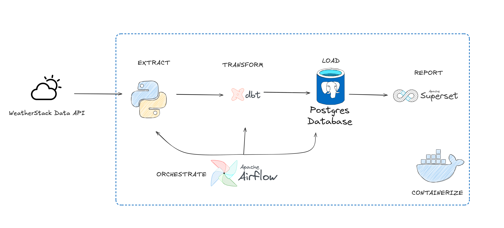
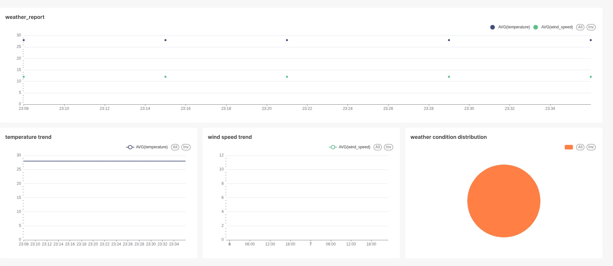

# Weather Data Pipeline Project
*A hands-on project to practice Postgres, DBT, Airflow, Superset, and Docker.*

---

## Overview
This project implements a modern **ETL pipeline** for weather data.  
It collects **real-time weather data** from the [WeatherStack API](https://weatherstack.com/), loads it into **PostgreSQL**, cleans and transforms the data using **dbt**, orchestrates the workflow with **Airflow**, and visualizes insights with **Apache Superset**.  

All components are containerized and managed via **Docker Compose**.



---

## Tech Stack
- **Weatherstack API** → Data source (JSON weather data).  
- **PostgreSQL** → Stores raw and transformed weather data.  
- **dbt** → Cleans & transforms raw data into analytics-ready models.  
- **Apache Airflow** → Orchestrates the pipeline (extract → load → transform).  
- **Apache Superset** → Business intelligence & visualization.  
- **Docker Compose** → Container orchestration.

---

## Project Structure
```

├── airflow/ # Airflow dags & configs
├── api-request/ # Scripts to fetch weather data from API
├── dbt/ # dbt project (models, sources, transformations)
├── docker/ # Custom Dockerfiles & init scripts
├── docs/ # Images
├── postgres/ # Database initialization scripts
├── docker-compose.yaml # Orchestration of all services
└── README.md # Project documentation

```
---

## How It Works
1. **Extract** → Python script (`api-request/`) fetches weather data from the API.  
2. **Load** → Data is ingested into **Postgres (raw_weather_data)**.  
3. **Transform** → **dbt** models clean, de-duplicate, and create analytics tables.  
4. **Orchestrate** → **Airflow DAGs** schedule extract/load/transform tasks.  
5. **Visualize** → **Superset** dashboards for weather trends & insights.  

---

## Set Up
### 1. Clone the repo
```bash
git clone https://github.com/toilahd/weather-data-pipeline.git
cd weather-data-pipeline
```
### 2. Create a .env file

```env
# API
api_key=YOUR_WEATHERSTACK_API_KEY

# Database
DB_NAME=db
DB_USER=db_user
DB_PASSWORD=db_password
DB_HOST=db
DB_PORT=5432
```

### 3. Start
```bash
docker compose up -d
```
### 4. Access the tools
- Airflow → http://localhost:8080
- Superset → http://localhost:8088

## Example Dashboard

