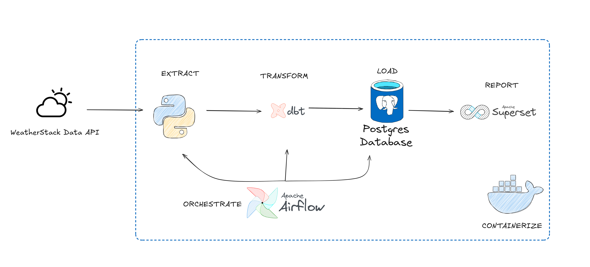

# Weather Data Pipeline Project
*A production-grade data engineering project showcasing modern ETL practices, data quality, and MLOps principles.*

[](https://github.com)
[](https://github.com)
[](https://www.python.org/)

---

## 🎯 Project Overview

This project implements a **production-ready ETL pipeline** for weather data that demonstrates enterprise-level data engineering practices. It collects real-time weather data from multiple cities worldwide, validates data quality, transforms it using modern data tools, and provides visualization through interactive dashboards.

**Key Highlights:**
- ✅ Multi-city weather tracking (8 cities globally)
- ✅ Comprehensive data validation and quality checks
- ✅ Retry logic and error handling
- ✅ CI/CD pipeline with automated testing
- ✅ Data quality audit trail
- ✅ Performance monitoring and metrics
- ✅ Incremental data loading
- ✅ 90-day data retention policy



---

## 🏗️ Architecture

### Data Flow
```
WeatherStack API → Python ETL → PostgreSQL → dbt Transformations → Superset Dashboards
                         ↓
                   Data Validation
                         ↓
                   Quality Audit Log
```

### Technology Stack

| Layer | Technology | Purpose |
|-------|-----------|---------|
| **Data Source** | WeatherStack API | Real-time weather data |
| **Extraction** | Python (with retry logic) | API data fetching |
| **Storage** | PostgreSQL | Raw and transformed data |
| **Transformation** | dbt | Data modeling & testing |
| **Orchestration** | Apache Airflow | Workflow scheduling |
| **Visualization** | Apache Superset | BI dashboards |
| **Infrastructure** | Docker Compose | Container orchestration |
| **CI/CD** | GitHub Actions | Automated testing & deployment |

---

## 📊 Key Features

### 1. **Robust Data Extraction**
- Multi-city support (8 cities: Ho Chi Minh, Hanoi, New York, London, Tokyo, Singapore, Sydney, Paris)
- Automatic retry logic (3 attempts with exponential backoff)
- API rate limiting protection
- Comprehensive error handling
- Connection pooling for efficiency

### 2. **Data Quality Framework**
- **Pre-insertion validation**:
  - Temperature range checks (-100°C to 60°C)
  - Wind speed validation (0-200 km/h)
  - Humidity bounds (0-100%)
  - Geographic coordinate validation
- **Audit logging**: Failed validations stored for analysis
- **dbt tests**: 15+ data quality tests
- **Freshness checks**: Alert if data older than 6 hours

### 3. **Advanced Transformations**
- **Staging layer**: Deduplication and cleaning
- **Marts layer**: 
  - Daily aggregations with trends
  - Latest weather snapshot
  - 7-day and 30-day rolling averages
  - Temperature volatility analysis
  - Anomaly detection

### 4. **Monitoring & Observability**
- Structured logging (file + console)
- Performance metrics tracking
- API success rate monitoring
- Database operation metrics
- Pipeline execution summaries

### 5. **CI/CD Pipeline**
- Automated linting (Black, Flake8, Pylint)
- Unit tests with coverage reporting
- dbt model validation
- Security vulnerability scanning
- Docker build verification

---

## 📁 Project Structure

```
├── .github/
│   └── workflows/
│       └── ci-cd.yml              # CI/CD pipeline configuration
├── airflow/
│   └── dags/
│       └── orchestrator.py        # Enhanced DAG with task groups
├── api-request/
│   ├── api_request.py             # API client with retry logic
│   ├── config.py                  # Centralized configuration
│   ├── exceptions.py              # Custom exceptions
│   ├── insert_records.py          # Database operations with pooling
│   ├── logger_config.py           # Logging setup
│   ├── metrics.py                 # Performance monitoring
│   ├── validators.py              # Data validation logic
│   ├── test_pipeline.py           # Unit tests
│   ├── requirements.txt           # Python dependencies
│   └── README.md                  # Module documentation
├── dbt/
│   ├── my_project/
│   │   ├── models/
│   │   │   ├── sources/
│   │   │   │   └── sources.yml    # Source definitions with tests
│   │   │   ├── staging/
│   │   │   │   ├── stg_weather_data.sql
│   │   │   │   └── schema.yml
│   │   │   └── marts/
│   │   │       ├── daily_average.sql
│   │   │       ├── weather_report.sql
│   │   │       ├── weather_trends.sql
│   │   │       └── schema.yml     # Model tests
│   │   └── dbt_project.yml
│   ├── profiles.yml
│   └── README.md                  # dbt documentation
├── docker-compose.yaml            # Service orchestration
├── Makefile                       # Automation commands
└── README.md                      # This file
```

---

## 🚀 Getting Started

### Prerequisites
- Docker & Docker Compose
- WeatherStack API key ([Get free key](https://weatherstack.com/))
- 4GB+ RAM recommended

### Quick Start

1. **Clone the repository**
   ```bash
   git clone https://github.com/toilahd/weather-data-pipeline.git
   cd weather-data-pipeline
   ```

2. **Setup environment**
   ```bash
   make setup
   # Edit .env and add your WeatherStack API key
   ```

3. **Start the pipeline**
   ```bash
   make start
   ```

4. **Access the applications**
   - **Airflow**: http://localhost:8000 (username: admin, check logs for password)
   - **Superset**: http://localhost:8088 (username: admin, password: admin)
   - **PostgreSQL**: localhost:5000

### Manual Setup (Alternative)

```bash
# Create .env file
cat > .env << EOF
api_key=YOUR_WEATHERSTACK_API_KEY
DB_NAME=db
DB_USER=db_user
DB_PASSWORD=db_password
DB_HOST=db
DB_PORT=5432
EOF

# Start services
docker-compose up -d

# Check service health
make check-health
```

---

## 🔧 Usage

### Using Makefile Commands

```bash
make help           # Show all available commands
make start          # Start all services
make stop           # Stop all services
make logs           # View logs
make test           # Run unit tests
make lint           # Run linting
make dbt-run        # Run dbt models
make dbt-test       # Run dbt tests
make stats          # Show pipeline statistics
make backup-db      # Backup database
```

### Manual Operations

```bash
# Run Python tests
cd api-request && pytest test_pipeline.py -v --cov=.

# Run dbt models
docker-compose run --rm dbt run

# Run dbt tests
docker-compose run --rm dbt test

# View database stats
make stats

# Access database
make db-shell
```

---

## 📈 Data Models

### Enhanced Database Schema

**Table: `dev.raw_weather_data`**
- Enhanced with 18+ fields including temperature, humidity, pressure, UV index
- Unique constraint on (city, time)
- Indexed for performance

**Table: `dev.data_quality_audit`**
- Tracks validation failures
- Stores raw data for debugging
- Timestamped audit trail

### dbt Transformations

1. **stg_weather_data** (Incremental)
   - Deduplicates records
   - Normalizes timestamps
   - Cleans data

2. **daily_average** (Table)
   - Daily statistics by city
   - Temperature trends
   - Observation counts

3. **weather_report** (Table)
   - Latest weather snapshot
   - Contextual categorizations
   - Dashboard-ready

4. **weather_trends** (View)
   - 7-day and 30-day rolling averages
   - Volatility indicators
   - Anomaly detection

---

## 🧪 Testing Strategy

### Unit Tests
```bash
make test
```
- API client testing
- Validation logic
- Configuration handling
- Mock API responses

### dbt Tests
```bash
make dbt-test
```
- Source data quality
- Model transformations
- Business logic validation
- Freshness checks

### CI/CD Tests
- Automated on every push/PR
- Linting and formatting
- Unit test coverage
- Security scanning
- Docker build verification

---

## 📊 Monitoring & Metrics
